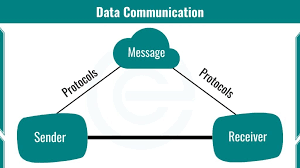
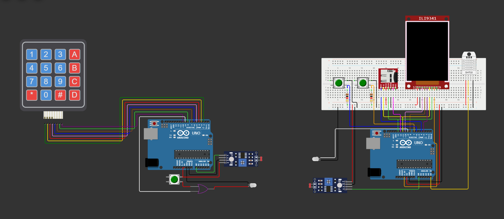

# Light Communication Between Decentralized Systems

This project demonstrates a lightweight optical communication system where multiple nodes exchange data using laser/LED transmitters and phototransistor receivers. Each node functions not only as a transmitter or receiver, but as part of a decentralized network capable of two-way communication and sensor-based data exchange.

A detailed explanation of the working principle, hardware design, signal processing, challenges, and improvements can be found in the project report.

---

## Table of Contents

1. [Project Demonstration](#project-demonstration-youtube)
2. [Hardware Used](#hardware-used)
3. [Circuit Diagram](#circuit-diagram)
4. [Software Used](#software-used)
5. [How the Communication Works](#how-the-communication-works)
6. [Timer & Frequency Configuration](#timer--frequency-configuration-summary)
7. [Transmitter & Receiver Code](#transmitter--receiver-code)
8. [Challenges Faced](#challenges-faced)
9. [Future Improvements](#future-improvements)
10. [Team Members](#team-members)
11. [Supervision](#supervision)
12. [Contact](#contact)

---

## Project Demonstration (YouTube)

[](https://youtu.be/6qlJLCeCZqs?feature=shared)
---

## Hardware Used

* Arduino Uno (ATmega328P)
* Laser diode transmitter module
* Phototransistor receiver with amplification stage
* HR-202 humidity sensor
* Standard temperature sensor
* Logic ICs (e.g., OR gate 7432)
* Supporting resistors, capacitors, driver transistors, wiring, and breadboard/PCB

---

## Circuit Diagram




---

## Software Used

* Arduino IDE 1.8.19
* Wokwi (for simulation tests)

---

## How the Communication Works

Each node encodes data using timer-generated square waves (5 kHz carrier using Timer1).
The laser transmits intensity-modulated pulses, and the phototransistor receives and converts them to electrical signals.
Decoded data is processed and shared among nodes, enabling decentralized data exchange.

---

## Timer & Frequency Configuration (Summary)

Timer1 is configured with:

* **Prescaler → 8 (CS11 = 1)**
* **OCR1A = 399**

Using the formula:

```
f = 16 MHz / (2 × prescaler × (OCR1A + 1))
f = 5 kHz
```

This generates a stable 5 kHz carrier for modulation.

---

## Transmitter & Receiver Code

To keep the README clean, the complete code is available in the repository:

* **Transmitter Code:** `/tx24/tx24.ino`
* **Receiver Code:** `/rx24/rx24.ino`

Both codes include:

* Timer1 configuration
* Interrupt Service Routines
* Signal encoding/decoding
* Hardware abstraction and sensor integration

---

## Challenges Faced

* Limited switching speed of low-cost laser modules
* Alignment sensitivity between TX and RX
* Slow response of LDR/solar cells (eventually replaced with phototransistor)
* Constraints of low-memory microcontrollers
* Need for precise timer control and clean filtering

---

## Future Improvements

* Faster photodiode + TIA receiver
* Better laser driver for higher bandwidth
* CRC-based error checking
* Node discovery and multi-hop networking
* Higher-level communication protocol

---

## Team Members
* [Shrinivas Basanagouda Malipatil](https://github.com/Air-36)    
* [Shishir Ravi Jois](https://github.com/ShishirRJ)              

## Supervision
This project was completed under the guidance of:

[Dr. Srinivas Boppu](https://secs.iitbbs.ac.in/index.php/sboppu/)  
School of Electrical and computer sciences,  
Indian Institute of technology,    
Bhubaneshwar

## Contact 
Shrinivas Basanagouda Malipatil   
Email    : shrinivasmalipatil@gmail.com   
LinkedIn : [Shrinivas Malipatil](https://in.linkedin.com/in/shrinivas-malipatil-2745492b8)

Shishir Ravi Jois   
E-mail   : shishirjois04@gmail.com  
LinkedIn : [Shishir Ravi Jois](https://www.linkedin.com/in/shishir-ravi-jois-a8a595280)
